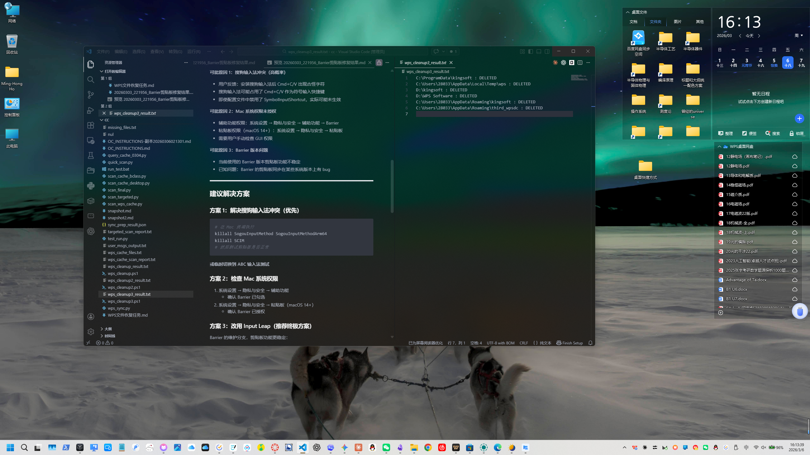

# VS Code 毛玻璃透明效果（Windows）

[English](README.md) | [简体中文](README.zh-CN.md)

这是一个可复现、可脚本化的方案，包含：
- 编辑器正文透明（acrylic）
- 侧边栏 / 面板 / WebView / Markdown 预览透明
- 编辑区顶部 sticky 区保持不透明
- 标题栏保持不透明，但窗口控制按钮可透明
- 窗口大小可正常调节

## 说明
- 推荐搭配深色主题（浅色主题未做完整调优）。
- 推荐主题是 `One Dark Pro`，但脚本**不会强制**改你的主题。
- 你可以用自己喜欢的主题，只要视觉效果满意即可。

## 效果图



## 环境
- 系统：Windows
- VS Code 安装路径：`D:\Microsoft VS Code`
- 示例使用主题：`One Dark Pro`
- 示例中自动深浅切换：`false`

## 一键应用
请在**管理员 PowerShell**中运行：

```powershell
& ".\scripts\reapply-vscode-transparency.ps1"
```

可选参数：

```powershell
# 调整透明度
& ".\scripts\reapply-vscode-transparency.ps1" -Opacity 0.35

# 不重启 VS Code
& ".\scripts\reapply-vscode-transparency.ps1" -NoRestart

# 自定义 VS Code 安装路径
& ".\scripts\reapply-vscode-transparency.ps1" -VsCodeRoot "D:\Microsoft VS Code"
```

## 脚本会修改哪些文件
- `%APPDATA%\Code\User\settings.json`
- `<VSCodeHashDir>\resources\app\out\main.js`
- `<VSCodeHashDir>\resources\app\extensions\markdown-language-features\media\markdown.css`
- `<VSCodeHashDir>\resources\app\extensions\github\markdown.css`

脚本在修改前会自动生成备份文件。

## 常见问题
### 1）窗口无法调节大小
请确认：
- `vscode_vibrancy.disableFramelessWindow = true`

### 2）界面发黑 / 黑色遮罩过重
减少 `workbench.colorCustomizations` 里的深色遮罩，优先使用透明色值。

### 3）Markdown 预览没有透明
重新应用内置 markdown css 补丁（脚本已包含）。

### 4）VS Code 更新后效果消失
更新会覆盖安装目录补丁，重新执行脚本即可恢复。

## 安全说明
- 修改安装目录必须使用管理员权限。
- 脚本会生成 `.bak_*` 备份。
- 需要恢复默认效果时，可还原备份或重装/更新 VS Code。


